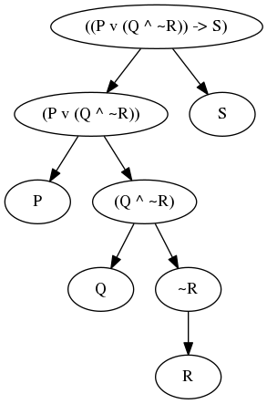

# PropLog

A propositional logic parser with some extras.

## Structure:

- `data.py` all the data structures
- `parser.py` exports `parse`
- `truth_table.py` creates a panda data frame (also has export option to markdown table)

## Capabilities

### Parser

to give an example I use the following expression:

    (A -> A) implies not (B * ((((~A))))) && (A -> A)


And parse it to an object structure, which stringifies it to:

    ((A -> A) -> (~(B ^ ~A) ^ (A -> A)))

All default behaviour, everything is adaptable

**CODE:**

```
parse(r'(A -> A) implies not (B * ((((~A))))) && (A -> A)')
```

### Truth table script

  A |   B | (A -> A) |  ~A | (B ^ ~A) | ~(B ^ ~A) | (~(B ^ ~A) ^ (A -> A)) | ((A -> A) -> (~(B ^ ~A) ^ (A -> A)))
--- | --- | -------- | --- | -------- | --------- | ---------------------- | ------------------------------------
  0 |   0 |        1 |   1 |        0 |         1 |                      1 |                                    1
  1 |   0 |        1 |   0 |        0 |         1 |                      1 |                                    1
  0 |   1 |        1 |   1 |        1 |         0 |                      0 |                                    0
  1 |   1 |        1 |   0 |        0 |         1 |                      1 |                                    1

**CODE:**

    table = truth_table(expr)
    print df2md(table)     # for markdown (home made function in truth_table.py)
    print table.to_latex() # for TeX
    print table.to_html()  # for HTML
    etc.

### Parse Tree



Generated via a `.dot` file

        with open('test.dot', 'w+') as f:
            expr = parse("P \/ Q /\ ! R -> S")
            f.write(expr_to_dot(expr))

For now there are some problems in the order of output, it doesn't guarantee for
instance that in the expression P -> S, S is going to be on the right. This is
an inherent problem with dot files. Making it a fairly unreliable.
